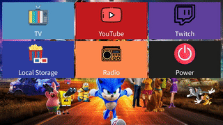
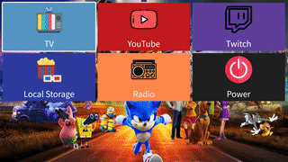

# Win Media Box
## Description
Win Media Box is a media application for Windows platform include possibility to watch IP-TV, listen radio, watch YouTube, Twitch and local video files. This application developed on .NET platform for desktops (WPF). I wrote this solution for personal use and mainly for my grandparents and therefore application is very easy to use and can be controlled by a remote controller ([like this](https://content2.rozetka.com.ua/goods/images/big/8861120.jpg)). I decided to create my own solution because I don't found a better application that would be laconic, simple enough and suit my needs, also I wanted to keep the functionality of a regular Windows PC.

## Preview

  
  

## Notes and features
* **Windows API**. Used by app for various interactions like send keys, shortcuts and power control. 
* **IP-TV**. To use this module you need pre-installed ip-tv player ([for example](https://borpas.info/iptvplayer)). Application just control open, close and can resize player, nothing special.
* **Radio**. For work with radio streams I used WPF MediaElement component.
* **Local media**. For now Local Storage module works only with files in video formats. I prefer to use as default player pre-installed in Windows (it's used in app by default). For this case you may need some extra configs for this player like enable always fullscreen.
* **WEB resources integration**. For YouTube and Twitch integration I decided to use embed players with WPF WebView component.
* **Customization**. User can customize appearance of app by edditing some settings in config json files and image files (like background of main screen, cards color, etc.)
* **Content management**. This part is not very easy to use, for now all management of content can be done by edditing json config files.
* **Instructions**. Application folders with edditable images and json config files contains readme text files with detailed instructions.
* **Power management**. Power menu allows to shutdown PC, go to sleep or use timer for those options.

## Todos
Although in current state this application match my needs and works stable enought in real world, for now it's not a fully finished project that need some important things to do:

* **Content management**. For now user need to edit json config files to manage content, but it's not very comfortable and need to be done from app functionality.
* **Settings**. As in previous point to edit some of customizeble things user need to work with app filesystem and manual replace files etc. So a better way will be to add this functionality inside app. Also this module can include some properties that for now hardcoded in app like remote controller buttons events, some other default properties, pathes etc.
* **Memory optimizations**. App has some problems with RAM usage, due to some not the most optimal constructions in business logic usage of RAM can be excessive.
